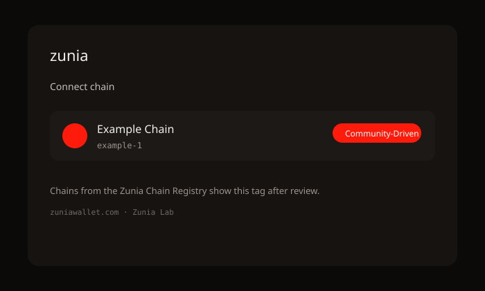

# Zunia Chain Registry

> Community-maintained chain metadata for the [Zunia wallet](https://zuniawallet.com).

[](LICENSE)
[](https://zuniawallet.com)

<p align="center">
  
</p>

## Overview

This repository holds chain configuration JSON for Cosmos-SDK, EVM, and SVM chains used by Zunia (browser extension and mobile). Entries follow the standard suggest-chain shape (`experimentalSuggestChain` / `window.zunia`).

Chain metadata ships to Zunia clients from this registry, so new chains and endpoint updates can roll out without an app release.

**Raw URL pattern:**

```
https://raw.githubusercontent.com/Zunia-Lab/zunia-chain-registry/main/cosmos/{chain-identifier}.json
https://raw.githubusercontent.com/Zunia-Lab/zunia-chain-registry/main/images/{chain-identifier}/chain.png
```

## Status

In active use by Zunia Lab. Upstream sync from [chainapsis/keplr-chain-registry](https://github.com/chainapsis/keplr-chain-registry) is documented in [UPSTREAM.md](./UPSTREAM.md).

## Related repositories

| Repository | Description |
|------------|-------------|
| [zunia-extension](https://github.com/Zunia-Lab/zunia-extension) | Browser extension (Chrome, Firefox, Edge, Safari) |
| [zunia-mobile](https://github.com/Zunia-Lab/zunia-mobile) | Mobile wallet |
| [zunia-docs](https://github.com/Zunia-Lab/zunia-docs) | Documentation |
| [zunia-brand](https://github.com/Zunia-Lab/zunia-brand) | Brand assets |

## Quick start

```shell
yarn install
yarn validate cosmos/{your-file}.json
yarn validate evm/{your-file}.json
yarn validate svm/{your-file}.json
```

> **Warning**  
> Always run `yarn validate` on your local machine before opening a pull request. Read the feature requirements carefully for Cosmos, EVM, and SVM chains.

## Contributing

1. Fork this repository and create a branch.
2. Add or update chain JSON under `cosmos/`, `evm/`, or `svm/`.
3. Add a 256×256 PNG logo under `images/{chain-identifier}/chain.png`.
4. Run `yarn validate` on your file.
5. Open a PR using the template.

See [CONTRIBUTING.md](./CONTRIBUTING.md).

## Community-driven chains

Once a pull request is approved, Zunia shows a **Community-Driven** tag on the chain connection screen so users know the integration was proposed by the community and reviewed by Zunia Lab.

<p align="center">
  
</p>

---

# Guidelines for community chain integration

Zunia is a multi-chain wallet for the Cosmos ecosystem (extension + mobile on the same keys), with growing support for EVM and SVM networks. Permissionless suggest-chain support lets front-ends and chain teams request chains that are not natively bundled.

This registry is the community-driven path to add and update that metadata for all Zunia users.

## Table of contents

- [Requirements and preparation](#requirements-and-preparation)
- [Cosmos-SDK-based chains](#cosmos-sdk-based-chains)
- [EVM-based chains](#evm-based-chains)
- [SVM-based chains](#svm-based-chains)
- [Notes](#notes)

## Requirements and preparation

This guide lists the information required to register a chain for Zunia. Submission does not guarantee inclusion; Zunia Lab runs a minimal verification pass for security and completeness.

Approved entries appear in Zunia with the Community-Driven tag (see screenshot above).

# Cosmos-SDK-based chains

## Directory structure

`chainId` is `{identifier}-{version}`. **chain-identifier** is the text before the version. Examples:

```
  cosmoshub-4                         → cosmoshub
  crypto-org-chain-mainnet-1          → crypto-org-chain-mainnet
  evmos_9001-2                        → evmos_9001
  shentu-2.2                          → shentu-2.2
```

```
.
├── cosmos                       # Mainnet / testnet JSON
│     ├── cosmoshub.json         # Named `{chain-identifier}.json`
│     ├── osmosis.json
│     └── ...
└── images
      ├── cosmoshub
      │     └── chain.png        # 256×256 PNG
      ├── osmosis
      └── ...
```

### Registration form example

```json
{
  "chainId": "osmosis-1",
  "chainName": "Osmosis",
  "chainSymbolImageUrl": "https://raw.githubusercontent.com/Zunia-Lab/zunia-chain-registry/main/images/osmosis/chain.png",
  "rpc": "https://rpc-osmosis.blockapsis.com",
  "rest": "https://lcd-osmosis.blockapsis.com",
  "nodeProvider": {
    "name": "Blockapsis",
    "email": "infra@blockapsis.com",
    "website": "https://blockapsis.com/"
  },
  "bip44": {
    "coinType": 118
  },
  "bech32Config": {
    "bech32PrefixAccAddr": "osmosis",
    "bech32PrefixAccPub": "osmosispub",
    "bech32PrefixValAddr": "osmosisvaloper",
    "bech32PrefixValPub": "osmosisvaloperpub",
    "bech32PrefixConsAddr": "osmosisvalcons",
    "bech32PrefixConsPub": "osmosisvalconspub"
  },
  "currencies": [
    {
      "coinDenom": "OSMO",
      "coinMinimalDenom": "uosmo",
      "coinDecimals": 6,
      "coinGeckoId": "osmosis"
    }
  ],
  "feeCurrencies": [
    {
      "coinDenom": "OSMO",
      "coinMinimalDenom": "uosmo",
      "coinDecimals": 6,
      "coinGeckoId": "osmosis",
      "gasPriceStep": {
        "low": 0.01,
        "average": 0.025,
        "high": 0.03
      }
    }
  ],
  "stakeCurrency": {
    "coinDenom": "OSMO",
    "coinMinimalDenom": "uosmo",
    "coinDecimals": 6,
    "coinGeckoId": "osmosis"
  },
  "features": ["cosmwasm", "osmosis-txfees"],
  "explorers": {
    "txPage": "https://www.mintscan.io/osmosis/tx/{txHash}"
  }
}
```

### Field requirements

- **chainId:** `{identifier}-{version}` (e.g. `cosmoshub-4`)
- **chainName:** Display name in Zunia
- **chainSymbolImageUrl:** `https://raw.githubusercontent.com/Zunia-Lab/zunia-chain-registry/main/images/{chain-identifier}/{file}.png`
- **rpc / rest:** HTTPS endpoints
- **nodeProvider:** `name`, `email`, optional `website`
- **walletUrlForStaking** (optional): URL opened from Zunia’s staking CTA
- **bip44:** Coin type (`118` recommended for Cosmos)
- **bech32Config:** Address prefixes
- **currencies / feeCurrencies / stakeCurrency:** Native tokens only (no IBC tokens here)
- **coinGeckoId** (optional): CoinGecko API id for prices in Zunia (not accepted for testnets)
- **features:** `cosmwasm`, `secretwasm`, `eth-address-gen`, `eth-key-sign`, `eth-secp256k1-cosmos`, `axelar-evm-bridge`, `osmosis-txfees`, …
- **isTestnet:** `true` for testnet/devnet
- **explorers.txPage:** Template with `{txHash}`, `{txHash:lowercase}`, or `{txHash:uppercase}`

# EVM-based chains

## Directory structure

Identifier format: `eip155:{eip155-chain-id}` ([CAIP-2](https://github.com/ChainAgnostic/CAIPs/blob/main/CAIPs/caip-2.md)).

```
  Ethereum → eip155:1
  Optimism → eip155:10
  Polygon  → eip155:137
```

```
.
├── evm
│     ├── eip155:1.json
│     └── ...
└── images
      ├── eip155:1
      │     ├── chain.png
      │     ├── ethereum-native.png
      │     └── erc20/{contract}.png
      └── ...
```

### Registration form example

```json
{
  "rpc": "https://ethereum.publicnode.com",
  "websocket": "wss://ethereum.publicnode.com",
  "nodeProvider": {
    "name": "PublicNode",
    "email": "hello@zuniawallet.com",
    "website": "https://zuniawallet.com"
  },
  "chainId": "eip155:1",
  "chainName": "Ethereum",
  "chainSymbolImageUrl": "https://raw.githubusercontent.com/Zunia-Lab/zunia-chain-registry/main/images/eip155:1/chain.png",
  "bip44": {
    "coinType": 60
  },
  "currencies": [
    {
      "coinDenom": "ETH",
      "coinMinimalDenom": "ethereum-native",
      "coinDecimals": 18,
      "coinGeckoId": "ethereum",
      "coinImageUrl": "https://raw.githubusercontent.com/Zunia-Lab/zunia-chain-registry/main/images/eip155:1/ethereum-native.png"
    }
  ],
  "feeCurrencies": [
    {
      "coinDenom": "ETH",
      "coinMinimalDenom": "ethereum-native",
      "coinDecimals": 18,
      "coinGeckoId": "ethereum",
      "coinImageUrl": "https://raw.githubusercontent.com/Zunia-Lab/zunia-chain-registry/main/images/eip155:1/ethereum-native.png"
    }
  ],
  "features": [],
  "explorers": {
    "txPage": "https://etherscan.io/tx/0x{txHash}"
  }
}
```

### Field requirements

- **rpc / websocket:** HTTPS / WSS endpoints
- **nodeProvider:** Provider contact details
- **chainId:** `eip155:{id}`
- **bip44:** `60` recommended
- **coinGeckoId** (optional): For prices in Zunia (not for testnets)
- **features:** e.g. `op-stack-l1-data-fee`
- **explorers.txPage:** Same placeholders as Cosmos

# SVM-based chains

## Directory structure

CAIP-2 `{namespace}:{reference}` (base58 reference for Solana).

```
  Solana Mainnet → solana:5eykt4UsFv8P8NJdTREpY1vzqKqZKvdp
  Solana Devnet  → solana:EtWTRABZaYq6iMfeYKouRu166VU2xqa1
```

```
.
├── svm
│     ├── solana:5eykt4UsFv8P8NJdTREpY1vzqKqZKvdp.json
│     └── ...
└── images
      ├── solana:5eykt4UsFv8P8NJdTREpY1vzqKqZKvdp
      │     ├── chain.png
      │     └── sol.png
      └── ...
```

### Registration form example

```json
{
  "rpc": "https://api.mainnet-beta.solana.com",
  "websocket": "wss://api.mainnet-beta.solana.com",
  "chainId": "solana:5eykt4UsFv8P8NJdTREpY1vzqKqZKvdp",
  "chainName": "Solana",
  "chainSymbolImageUrl": "https://raw.githubusercontent.com/Zunia-Lab/zunia-chain-registry/main/images/solana:5eykt4UsFv8P8NJdTREpY1vzqKqZKvdp/chain.png",
  "bip44": {
    "coinType": 501
  },
  "currencies": [
    {
      "coinDenom": "SOL",
      "coinMinimalDenom": "lamport",
      "coinDecimals": 9,
      "coinGeckoId": "solana",
      "coinImageUrl": "https://raw.githubusercontent.com/Zunia-Lab/zunia-chain-registry/main/images/solana:5eykt4UsFv8P8NJdTREpY1vzqKqZKvdp/sol.png"
    }
  ],
  "feeCurrencies": [
    {
      "coinDenom": "SOL",
      "coinMinimalDenom": "lamport",
      "coinDecimals": 9,
      "coinGeckoId": "solana"
    }
  ],
  "explorers": {
    "txPage": "https://explorer.solana.com/tx/{txHash}"
  }
}
```

### Field requirements

- **rpc / websocket**, **chainId**, **chainName**, **images**, **bip44** (`501` for Solana)
- **coinGeckoId** (optional): For prices in Zunia (not for testnets)
- **isTestnet**, **explorers.txPage** as above

## Notes

- Chain JSON must be valid JSON.
- Logos: PNG, 256×256. Zunia crops them to a circle in the UI.
- If `coinImageUrl` is missing, Zunia may hide the token icon.
- Confirm RPC / REST / WebSocket health and that `chainId` matches the node.
- Prefer CoinGecko ids only when the token is listed.
- Include references for gas price changes in the PR description.

## Security

See [SECURITY.md](./SECURITY.md). Only publish endpoints you trust.

## License

Apache-2.0.

Schema and validation tooling originated in [chainapsis/keplr-chain-registry](https://github.com/chainapsis/keplr-chain-registry). This repository is maintained by [Zunia Lab](https://github.com/Zunia-Lab) for [zuniawallet.com](https://zuniawallet.com).
